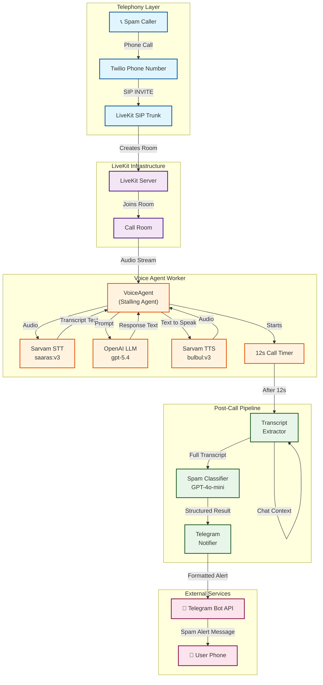
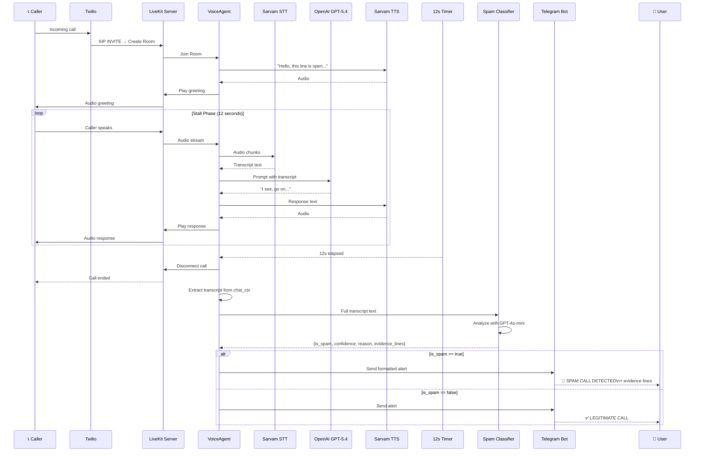

# High-Level Design: Spam Call Detection Agent

## Architecture Diagram



## Sequence Diagram



## Component Details

### 1. Telephony Layer
| Component | Purpose |
|-----------|---------|
| Twilio | Provides phone number and SIP trunking |
| LiveKit SIP | Converts PSTN calls to WebRTC rooms |

### 2. Voice Agent (Real-time)
| Component | Model/Service | Role |
|-----------|---------------|------|
| STT | Sarvam `saaras:v3` | Converts caller audio to text |
| LLM | OpenAI `gpt-5.4` | Generates stalling responses |
| TTS | Sarvam `bulbul:v3` | Converts responses to audio |
| Timer | Internal | Triggers classification after 12s |

### 3. Post-Call Pipeline
| Component | Model | Input | Output |
|-----------|-------|-------|--------|
| Transcript Extractor | - | LiveKit chat_ctx | Formatted transcript string |
| Spam Classifier | OpenAI `gpt-4o-mini` | Transcript | JSON: {is_spam, confidence, reason, evidence_lines} |
| Telegram Notifier | Telegram Bot API | Classification result | Formatted HTML message |

### 4. Data Flow

```
Audio → STT → Text → LLM → Response → TTS → Audio (loop for 12s)
                                                    ↓
                                              Transcript
                                                    ↓
                                              Classifier
                                                    ↓
                                        {is_spam, confidence, reason, evidence}
                                                    ↓
                                             Telegram Alert
```

## Configuration Points

| Setting | File | Default | Description |
|---------|------|---------|-------------|
| Call duration | `agent_config.toml` | 12s | How long to stall caller |
| Classification model | `agent_config.toml` | gpt-4o-mini | Model for spam detection |
| Stalling behavior | `agent_instructions.md` | - | Prompt for voice agent |
| STT language | `agent_config.toml` | unknown | Auto-detect caller language |
| TTS voice | `agent_config.toml` | priya | Voice for agent responses |
